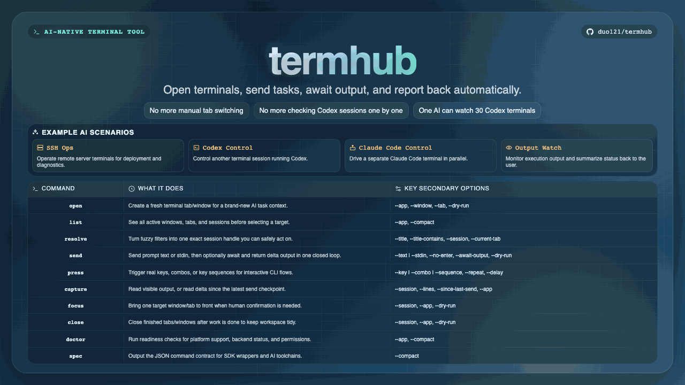
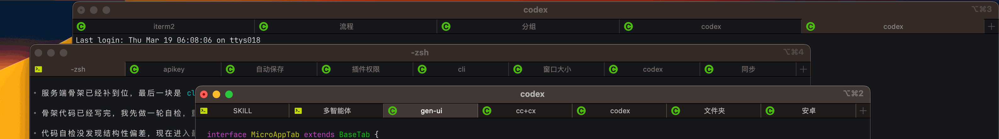

# termhub

[中文说明](./README.zh-CN.md)





`termhub` is an AI-native terminal control tool.

It is designed for this closed loop:

1. AI inspects what terminal sessions are open.
2. AI opens a window or tab when needed.
3. AI launches or targets a Codex session.
4. AI sends the task into that session.
5. AI captures only the new output produced after send and returns it to the user.

- Command: `termhub`
- Alias: `thub`
- npm package: `@duo121/termhub`
- macOS backends: `iTerm2`, `Terminal`
- Windows backends: `Windows Terminal`, `Command Prompt (CMD)`

## Install

```bash
npm install -g @duo121/termhub
```

Or Homebrew (macOS):

```bash
brew tap duo121/termhub https://github.com/duo121/termhub
brew install duo121/termhub/termhub
```

Install from GitHub Releases (without npm):

- `termhub_<version>_macos-arm64.tar.gz`
- `termhub_<version>_windows-x64.zip`

After extraction:

- macOS

```bash
chmod +x termhub
./termhub --version
```

- Windows (PowerShell)

```powershell
.\termhub.exe --version
```

## Quick Start For AI

```bash
termhub --help
termhub spec
termhub list
```

Use `spec` as machine-readable truth and `--help` as human-readable truth.
Both now include a `currentSession` hint near the top that you can copy directly into `--session` for AI handoff.

## SDK

`termhub` now ships an SDK preview entry:

```js
import { createTermhubClient } from "@duo121/termhub/sdk";
```

Core SDK capabilities:

- Open/close terminal targets.
- Find/resolve terminal sessions.
- Send keyboard text and key events (`key` / `combo` / `sequence`).
- Mouse click simulation on terminal target (`mouseClick`) on macOS.

Platform notes:

- macOS (`iTerm2` / `Terminal`): keyboard + mouse click are supported.
- Windows (`Windows Terminal` / `CMD`): keyboard control is supported; `mouseClick` currently returns unsupported.

SDK quick example:

```js
import { createTermhubClient } from "@duo121/termhub/sdk";

const client = createTermhubClient({ app: "iterm2" });

const opened = await client.open({ scope: "tab" });
await client.send({ session: opened.target.handle, text: "echo hello from sdk" });
await client.press({ session: opened.target.handle, key: "enter" });
const output = await client.capture({ session: opened.target.handle, lines: 20 });

console.log(output.text);
```

## Command Map

| Top-Level Command | What It Does | Common Secondary Flags |
| --- | --- | --- |
| `open` | Open terminal window or tab | `--app` `--window` `--tab` `--dry-run` |
| `list` | List running windows/tabs/sessions | `--app` `--compact` |
| `resolve` / `find` | Narrow fuzzy target to one exact session | `--title` `--title-contains` `--session` `--current-tab` |
| `send` | Send text and optionally await/capture output delta in one step | `--text` `--stdin` `--no-enter` `--await-output` `--dry-run` |
| `press` | Send real key/combo/sequence events | `--key` `--combo` `--sequence` `--repeat` `--delay` |
| `capture` | Read visible output or delta since latest send checkpoint | `--session` `--lines` `--since-last-send` `--app` |
| `focus` | Bring target window/session to front | `--session` `--app` `--dry-run` |
| `close` | Close target tab or window | `--session` `--app` `--dry-run` |
| `doctor` | Check platform/backend/automation readiness | `--app` `--compact` |
| `spec` | Print machine-readable JSON contract | `--compact` |

## AI Usage Rules

1. Always `resolve` (or `find`) to one exact target before mutating commands.
2. Use `--app` when multiple backends are active.
3. Use `--dry-run` before risky operations.
4. Use `send --no-enter` only when you plan a separate real key submit.
5. Never fake submit by appending literal newlines inside `--text` or stdin.

## Press Modes

`press` supports exactly one input mode:

- `--key <key>`
- `--combo <combo>` (for example `ctrl+c`, `cmd+k`)
- `--sequence <steps>` (for example `esc,down*5,enter`)

Extra controls:

- `--repeat <n>`: only for `--key` and `--combo`
- `--delay <ms>`: delay between repeated or sequenced key events

Examples:

```bash
termhub press --session <id|handle> --key enter
termhub press --session <id|handle> --combo ctrl+c
termhub press --session <id|handle> --sequence "esc,down*3,enter" --delay 60
```

## Typical AI Scenarios

Open a new iTerm2 window:

```bash
termhub open --app iterm2 --window
```

List all iTerm2 tabs:

```bash
termhub list --app iterm2
```

Close a specific tab by title:

```bash
termhub resolve --title Task1
termhub find --title Task1
termhub close --session <resolved-handle-or-session-id>
```

Read current Terminal tab (last 50 lines):

```bash
termhub resolve --app terminal --current-window --current-tab --current-session
termhub capture --app terminal --session terminal:session:<window-id>:<tab-index> --lines 50
```

Run command in Windows Terminal tab titled `API`:

```bash
termhub resolve --app windows-terminal --title API
termhub send --app windows-terminal --session windows-terminal:session:<window-handle>:<tab-index> --text "npm test"
```

## Send-To-Capture Delta Loop

`termhub` now supports a built-in session checkpoint loop so AI can capture only the new output produced after `send`.

Basic flow:

```bash
termhub send --session <id|handle> --text "npm test" --await-output 1200
```

How it works:

- `send` stores a checkpoint for that exact session before writing input.
- `send --await-output <ms>` waits and returns only delta output produced after that send.
- `capture --since-last-send` remains available when you want a separate explicit read step.

Concurrency:

- Checkpoints are session-scoped, so two AI agents can use different sessions in parallel without conflict.
- State files are stored under `~/.termhub/state` by default.

## Notes

- `--session` accepts native session id or namespaced handle.
- Windows `focus/send/capture/close` rely on PowerShell + UI Automation.
- Windows `capture` is best-effort based on visible text accessibility.
