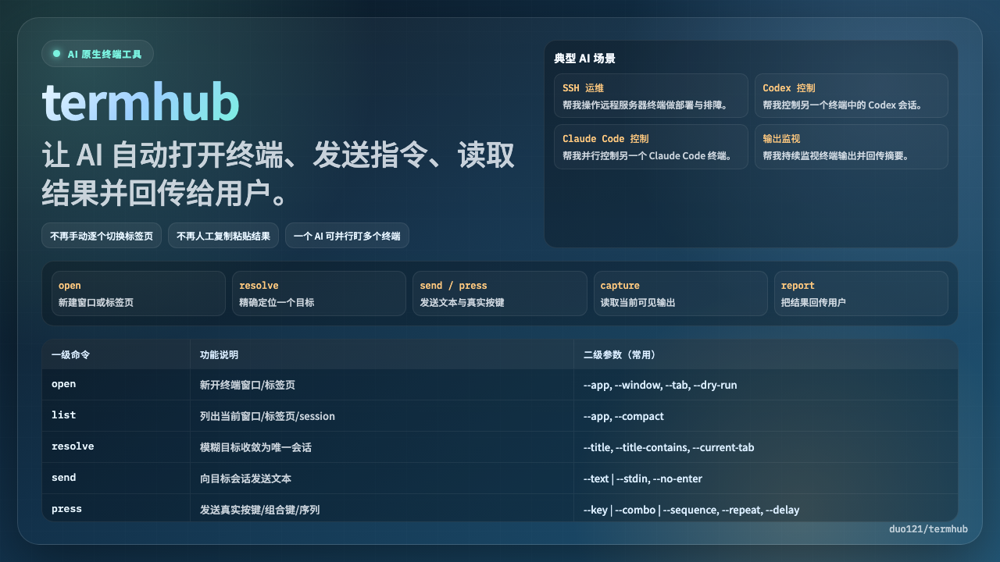

# termhub

[English README](./README.md)



`termhub` 是一个 AI 原生的终端控制工具。

它围绕这个闭环设计：

1. AI 先检查当前打开的终端会话。
2. AI 按需新开窗口或标签页。
3. AI 启动或定位 Codex 会话。
4. AI 把任务发送到该会话。
5. AI 读取输出并回传给用户。

- 主命令：`termhub`
- 别名：`thub`
- npm 包名：`@duo121/termhub`
- macOS 后端：`iTerm2`、`Terminal`
- Windows 后端：`Windows Terminal`、`Command Prompt (CMD)`

## 安装

```bash
npm install -g @duo121/termhub
```

或通过 Homebrew（macOS）：

```bash
brew tap duo121/termhub https://github.com/duo121/termhub
brew install duo121/termhub/termhub
```

从 GitHub Releases 安装（不走 npm）：

- `termhub_<version>_macos-arm64.tar.gz`
- `termhub_<version>_windows-x64.zip`

解压后：

- macOS

```bash
chmod +x termhub
./termhub --version
```

- Windows（PowerShell）

```powershell
.\termhub.exe --version
```

## AI 快速开始

```bash
termhub --help
termhub spec
termhub list
```

其中 `spec` 是机器可读事实源，`--help` 是人类可读事实源。

## SDK

`termhub` 已提供 SDK 预览入口：

```js
import { createTermhubClient } from "@duo121/termhub/sdk";
```

SDK 核心能力：

- 打开/关闭终端目标。
- 查找/定位终端会话。
- 模拟键盘输入与按键事件（`key` / `combo` / `sequence`）。
- 模拟鼠标点击终端目标（`mouseClick`，macOS 支持）。

平台说明：

- macOS（`iTerm2` / `Terminal`）：支持键盘与鼠标点击。
- Windows（`Windows Terminal` / `CMD`）：支持键盘控制；`mouseClick` 当前返回不支持。

SDK 快速示例：

```js
import { createTermhubClient } from "@duo121/termhub/sdk";

const client = createTermhubClient({ app: "iterm2" });

const opened = await client.open({ scope: "tab" });
await client.send({ session: opened.target.handle, text: "echo hello from sdk" });
await client.press({ session: opened.target.handle, key: "enter" });
const output = await client.capture({ session: opened.target.handle, lines: 20 });

console.log(output.text);
```

## 命令地图

| 一级命令 | 功能说明 | 二级参数（常用） |
| --- | --- | --- |
| `open` | 新开终端窗口或标签页 | `--app` `--window` `--tab` `--dry-run` |
| `list` | 列出当前窗口/标签页/session | `--app` `--compact` |
| `resolve` | 模糊目标收敛为唯一会话 | `--title` `--title-contains` `--session` `--current-tab` |
| `send` | 向目标会话发送文本 | `--text` `--stdin` `--no-enter` `--dry-run` |
| `press` | 发送真实按键/组合键/序列 | `--key` `--combo` `--sequence` `--repeat` `--delay` |
| `capture` | 读取可见终端输出 | `--session` `--lines` `--app` |
| `focus` | 聚焦目标窗口/会话 | `--session` `--app` `--dry-run` |
| `close` | 关闭目标标签页或窗口 | `--session` `--app` `--dry-run` |
| `doctor` | 检查平台/后端/自动化状态 | `--app` `--compact` |
| `spec` | 输出机器可读 JSON 契约 | `--compact` |

## AI 使用规则

1. 任何修改类动作前，先 `resolve` 到唯一目标。
2. 多后端并存时，显式加 `--app`。
3. 风险动作先用 `--dry-run`。
4. 只有打算后续单独提交时，才用 `send --no-enter`。
5. 不要在 `--text` 或 stdin 里用字面量换行模拟提交。

## Press 模式

`press` 必须且只能使用一种输入模式：

- `--key <key>`
- `--combo <combo>`（例如 `ctrl+c`、`cmd+k`）
- `--sequence <steps>`（例如 `esc,down*5,enter`）

附加控制：

- `--repeat <n>`：仅用于 `--key` 或 `--combo`
- `--delay <ms>`：重复或序列按键之间的毫秒延迟

示例：

```bash
termhub press --session <id|handle> --key enter
termhub press --session <id|handle> --combo ctrl+c
termhub press --session <id|handle> --sequence "esc,down*3,enter" --delay 60
```

## 典型 AI 场景

新开 iTerm2 窗口：

```bash
termhub open --app iterm2 --window
```

查看 iTerm2 全部标签页：

```bash
termhub list --app iterm2
```

按标题关闭指定标签页：

```bash
termhub resolve --title Task1
termhub close --session <resolved-handle-or-session-id>
```

读取当前 Terminal 标签页最后 50 行：

```bash
termhub resolve --app terminal --current-window --current-tab --current-session
termhub capture --app terminal --session terminal:session:<window-id>:<tab-index> --lines 50
```

在标题为 `API` 的 Windows Terminal 标签页运行命令：

```bash
termhub resolve --app windows-terminal --title API
termhub send --app windows-terminal --session windows-terminal:session:<window-handle>:<tab-index> --text "npm test"
```

## 说明

- `--session` 同时支持原生 session id 和 namespaced handle。
- Windows 的 `focus/send/capture/close` 依赖 PowerShell + UI Automation。
- Windows `capture` 是 best-effort，取决于可见文本可否被 UI Automation 读取。
